# Social Media Privacy Risk Assessment Framework

> Privacy-focused cybersecurity framework for assessing social-media exposure, account-security practices, social-engineering risk, digital-footprint risk, and personalized privacy improvements using synthetic/self-reported data.

   

> **This project is designed for defensive cybersecurity and privacy education. It uses synthetic or voluntarily provided assessment responses and does not scrape, track, or profile real social-media users.**

---

## Overview
Users answer **53 questions** about their own social-media settings and habits. The framework converts the answers into risk features and scores **10 categories**. It then produces:

- a **Privacy Risk Score (0–100)**, where higher means more exposure, with a **Low / Moderate / High / Critical** level
- **category-wise scores**, ranked **findings**, and **personalised recommendations** (Immediate / Important / Good practice)
- a **"What if I improve my settings?" simulator**
- a **dashboard** comparing your result with **1,000 synthetic records**
- a printable **privacy report** (HTML → PDF) and **privacy checklist**

The questionnaire **never asks for the sensitive value itself**. It asks *"Is your phone number publicly visible?"*, never *"What is your phone number?"*.

## Problem Statement
People often secure their passwords but still publish their birthday, workplace, live location and travel plans. There's no simple, private way to measure that exposure, separate it from account security, and know what to fix first.

## Objectives
- 40+ question assessment across 10 privacy and security categories
- Transparent, configurable risk-scoring model
- Personalised, prioritised recommendations and an improvement simulator
- Privacy-by-design implementation, proven by automated tests
- Synthetic data only; no scraping, no tracking, no PII

## Cybersecurity Relevance
Covers threat modelling, risk scoring, identity and account protection (MFA, password reuse, sessions), social-engineering awareness, least privilege for third-party apps, GRC-style risk matrices, and secure application development (validation, CSP, rate limiting, output encoding). See [docs/01_PROJECT_EXPLANATION.md](docs/01_PROJECT_EXPLANATION.md).

## Privacy vs Security
**Privacy** controls how personal information is collected, shared, exposed and used. **Security** protects accounts and systems from unauthorised access. **Strong account security ≠ strong privacy**: an account with MFA can still publish its owner's live location. The framework scores *Account Security* separately from the nine exposure categories.

## Features
| Feature | Where |
|---|---|
| 53-question questionnaire (10 categories) | `frontend/assessment.html`, `backend/services/questionnaire.py` |
| Allow-list input validation | `backend/utils/validators.py` |
| Feature extraction `extract_privacy_features()` | `backend/services/assessment_engine.py` |
| Category + overall scoring `calculate_privacy_risk()` | `backend/services/scoring_engine.py` |
| Findings `generate_privacy_findings()` | `backend/services/findings_engine.py` |
| Recommendations `generate_recommendations()` | `backend/services/recommendation_engine.py` |
| Improvement simulator | `backend/services/improvement_simulator.py` |
| Dashboard (6 charts + table views) | `frontend/dashboard.html` |
| Privacy report (HTML / PDF) | `backend/services/report_generator.py` |
| Printable checklist | `frontend/checklist.html` |
| Synthetic dataset (1,000 records) | `data/generate_dataset.py` |
| Local photo-metadata viewer / stripper | `tools/photo_metadata_viewer.py` |
| Privacy-first SQLite storage (opt-in) | `backend/models/database.py` |

## Architecture
```
User → Questionnaire → Input Validation → Feature Extraction
     → [Profile | Personal Info | Location | Content | Connections | Tagging |
        Account Security | Third-Party Apps | Social Engineering | Digital Footprint]
     → Category Scores → Risk Scoring Engine → Overall Risk + Level
     → Findings Engine → Recommendation Engine → Dashboard / Simulator / Report
     (optional, opt-in) → anonymous scores only → SQLite → aggregate statistics
```
Details: [docs/04_ARCHITECTURE_API_DATABASE.md](docs/04_ARCHITECTURE_API_DATABASE.md)

## Technology Stack
Python 3 · Flask · SQLite · HTML/CSS/JavaScript · Chart.js · pytest · Pillow (metadata tool). This is the beginner-friendly stack: one command starts everything, and there's no build step.

## Privacy Questionnaire
53 questions: **A** Profile Visibility (5) · **B** Personal Information (7) · **C** Location (6) · **D** Posts & Content (5) · **E** Friends/Followers (4) · **F** Tagging (4) · **G** Account Security (6) · **H** Third-Party Apps (4) · **I** Social Engineering (6) · **J** Digital Footprint (6). Full list with weights: [docs/02_PRIVACY_QUESTIONNAIRE.md](docs/02_PRIVACY_QUESTIONNAIRE.md)

## Risk Categories
| Category | Weight | | Category | Weight |
|---|---|---|---|---|
| Profile Visibility | 10% | | Tagging | 5% |
| Personal Information | 15% | | Account Security | 15% |
| Location Privacy | 15% | | Third-Party Apps | 5% |
| Posts & Content | 10% | | Social Engineering | 10% |
| Connections | 10% | | Digital Footprint | 5% |

## Risk Scoring
Answer → risk value 0–1 → category score = 100 × Σ(w·r)/Σw → overall = weighted average of categories.
**0–20 LOW · 21–40 MODERATE · 41–70 HIGH · 71–100 CRITICAL.**
> ⚠️ Weights and thresholds are **educational assumptions** and should be validated before any professional risk decision. See [docs/03_RISK_MODEL_AND_ANALYSIS.md](docs/03_RISK_MODEL_AND_ANALYSIS.md).

## Privacy Findings
Every risky answer (risk ≥ 0.5) becomes a finding with a severity (High/Medium/Low) based on potential impact and how risky the answer was. Findings are ranked, and the top 5 are highlighted.

## Recommendation Engine
One defensive recommendation per finding, prioritised **Immediate / Important / Good practice**. MFA off, password reuse and sharing verification codes are always Immediate.

## Improvement Simulator
Select findings to fix → the same engine re-scores → before/after, risk reduction and a per-category comparison. *Framework simulation, not a guarantee.*

## Digital Footprint
Evaluates self-reported practices only: old posts, old accounts, public comments, settings-review recency, username reuse and self-search.

## Social Engineering Awareness
How public context (employer, college, travel, family, interests, events) can make scams more believable, with defensive habits. No attack content is included. See [docs/07_SECURITY_AWARENESS.md](docs/07_SECURITY_AWARENESS.md).

## Account Security
MFA, password reuse, password manager, login alerts, recovery info and active sessions. These are shown as "Security controls on: x of 10".

## Privacy Dashboard
Your latest result plus synthetic-population charts: category comparison, risk distribution, top weaknesses, control adoption, digital-footprint distribution and improvement comparison. Each chart has a table view.

## Privacy Report
Assessment ID, date, overall risk, level, category scores, top findings, priority actions, recommendations, controls, checklist and disclaimer. It contains **no personal data**, is HTML-escaped and script-free, and can be printed to PDF.

## Privacy by Design
Data minimisation · purpose limitation · least privilege · **privacy by default (saving is off)** · transparency · user control (deletion token) · 30-day retention · secure processing. See [docs/08_PRIVACY_BY_DESIGN.md](docs/08_PRIVACY_BY_DESIGN.md).

---

## Installation

**Prerequisites:** Python 3.10+ and Git. Commands are shown for **Windows (PowerShell)**, with macOS/Linux equivalents noted.

**Step 1: Get the project**
```bash
git clone https://github.com/SNischayPrasad/Social-Media-Privacy-Risk-Assessment.git
cd Social-Media-Privacy-Risk-Assessment
```

**Step 2: Create a virtual environment**
```bash
python -m venv venv
venv\Scripts\activate
```
macOS/Linux: `python3 -m venv venv` then `source venv/bin/activate`

**Step 3: Install dependencies**
```bash
pip install -r requirements.txt
```

**Optional: configuration**
```bash
copy .env.example .env
```
macOS/Linux: `cp .env.example .env`. The defaults work without it.

## Usage

**Step 4: Generate the synthetic dataset** (already included; this regenerates it)
```bash
python data/generate_dataset.py
```

**Step 5: Start the backend**
```bash
python run.py
```

**Step 6: Start the frontend.** Nothing to do: Flask serves the frontend too.

**Step 7: Open the assessment:** <http://127.0.0.1:5000/assessment.html>

**Step 8: Complete the questionnaire.** Answer the questions, or click **Use fictional demo answers**.

**Step 9: Generate the privacy score.** Click **Calculate my privacy score**.

**Step 10: View the category analysis.** Scroll to the category chart, findings, controls and recommendations.

**Step 11: Run the improvement simulation.** Tick findings, then click **Simulate selected changes**.

**Step 12: Generate the report.** Click **Open printable report** (then Print → Save as PDF) or **Download report (HTML)**.

**Command-line demo** (no browser needed):
```bash
python tools/run_demo.py
```

### Safe Demonstration Profile (fictional)
Profile public · phone public · email private · full birthday public · location public · real-time check-ins · travel plans public · unknown requests often accepted · tag review off · MFA off · login alerts off · third-party apps not reviewed · old posts not reviewed.

```
OVERALL PRIVACY RISK: 82/100   LEVEL: CRITICAL   FINDINGS: 48   CONTROLS ENABLED: 0/10

CATEGORY SCORES   Profile 100 · Personal Info 78 · Location 85 · Content 82 · Connections 91
                  Tagging 100 · Account Security 90 · Third-Party 76 · Social Eng. 34 · Footprint 96

TOP RISKS         1. Phone number reported as publicly visible
                  2. Real-time location sharing enabled for a broad audience
                  3. Multi-factor authentication (MFA) is disabled
                  4. Travel plans shared publicly before or during trips
                  5. Real-time check-ins posted while still at the location

SIMULATION        Phone, birthday, location, travel → private · unknown requests → verify
                  tag review, MFA, login alerts → on · third-party apps → reviewed
                  82 CRITICAL  →  53 HIGH      RISK REDUCTION: 29 points
                  (all recommendations applied → 2 LOW)
```
The profile stays HIGH after 11 changes because it also has public posts, a public friends list, frequent geotags, old accounts and more. Privacy is many small settings, not one switch.

## API Documentation
| Method | Endpoint | Purpose |
|---|---|---|
| GET | `/api/questionnaire` | Questions, answers, category weights |
| POST | `/api/assessment` | Run an assessment (`"store": true` to save anonymously) |
| GET | `/api/assessment/{id}` | Saved assessment |
| GET | `/api/assessment/{id}/recommendations` | Its recommendations |
| DELETE | `/api/assessment/{id}` | Delete (header `X-Delete-Token`) |
| POST | `/api/assessment/simulate-improvement` | What-if simulation |
| POST | `/api/report` · GET `/api/assessment/{id}/report` | Printable HTML report |
| GET | `/api/dashboard/stats` | Aggregate statistics |
| GET | `/api/privacy-checklist` | Checklist |

Requests, responses, validation, errors, auth and privacy notes: [docs/04_ARCHITECTURE_API_DATABASE.md](docs/04_ARCHITECTURE_API_DATABASE.md#26-rest-api-design)

## Testing
```bash
python -m pytest -v
```
**65 tests pass**, including the 30 specified scenarios (TC01–TC30). Test-case table: [docs/05_TESTING.md](docs/05_TESTING.md)

## Security & Privacy Testing
Tests prove that no PII or raw answers are stored (schema allow-list plus a full DB dump check). They also cover input allow-listing, XSS escaping, CSP and security headers, rate limiting (429), 413 on oversized bodies, token-protected deletion, retention purging, generic error messages and environment-based configuration.

## Results
- Demo profile: **82 → 53** with 11 changes (−29); **→ 2** with all recommendations.
- Synthetic population (n = 1,000): mean **47.9**; distribution Low 151 / Moderate 244 / High 395 / Critical 210.
- Most common synthetic weaknesses: login alerts off (58%), MFA off (57%), tag review off (55%).
- 65/65 automated tests passing. Responsive down to 375 px, with light and dark themes.

## Limitations
Self-reported answers · uncalibrated educational weights · linear model (no aggregation effects) · platform-agnostic questions · synthetic analytics · single-process rate limiter and a development server.

## Future Improvements
Platform-specific checklists · organisational policy profiles · privacy quizzes and maturity scoring · family/teen modules · enterprise training with anonymous trends · GRC exports · model calibration · localisation · accessibility audit · report comparison over time · **local-only client-side mode**. None of these involve scraping or monitoring.

## Screenshots
All 29 screenshots are in [`screenshots/`](screenshots/) (index: [screenshots/README.md](screenshots/README.md)). They use only the fictional demo profile, and you can regenerate them with `pip install -r requirements-dev.txt` then `python tools/capture_screenshots.py`.

**Overview:** a fictional profile that redacts itself after a privacy review
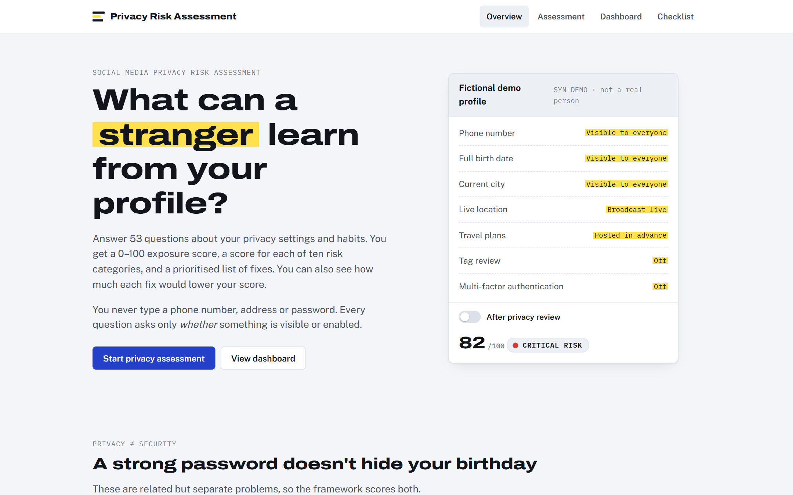

**Result:** 82/100 Critical for the over-sharing demo profile
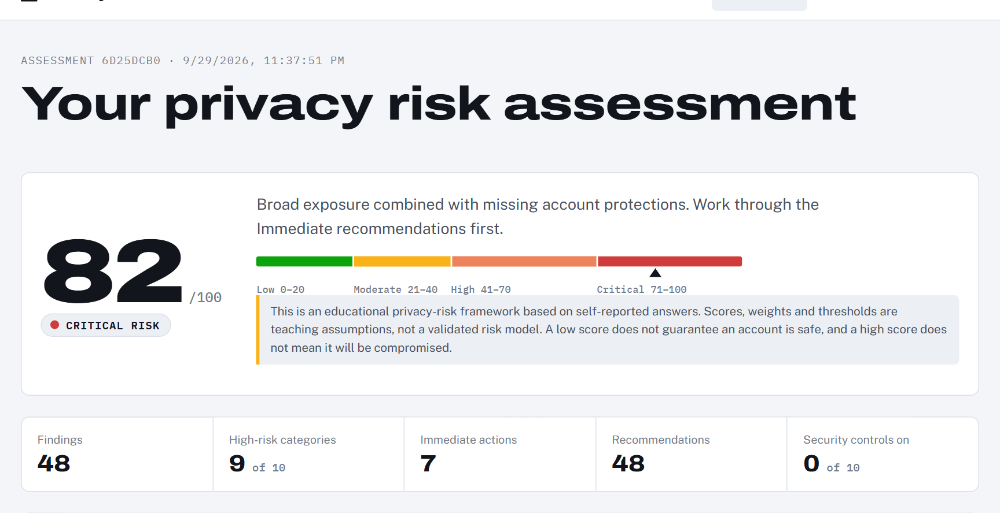

**Category analysis**
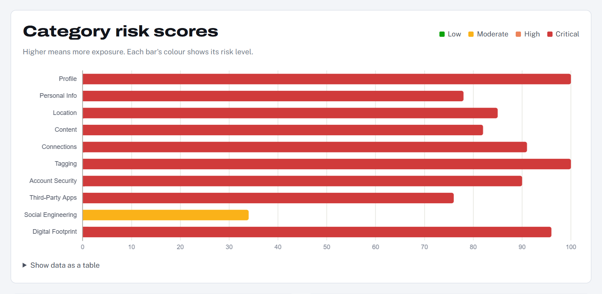

**Improvement simulator:** 11 changes, 82 → 53
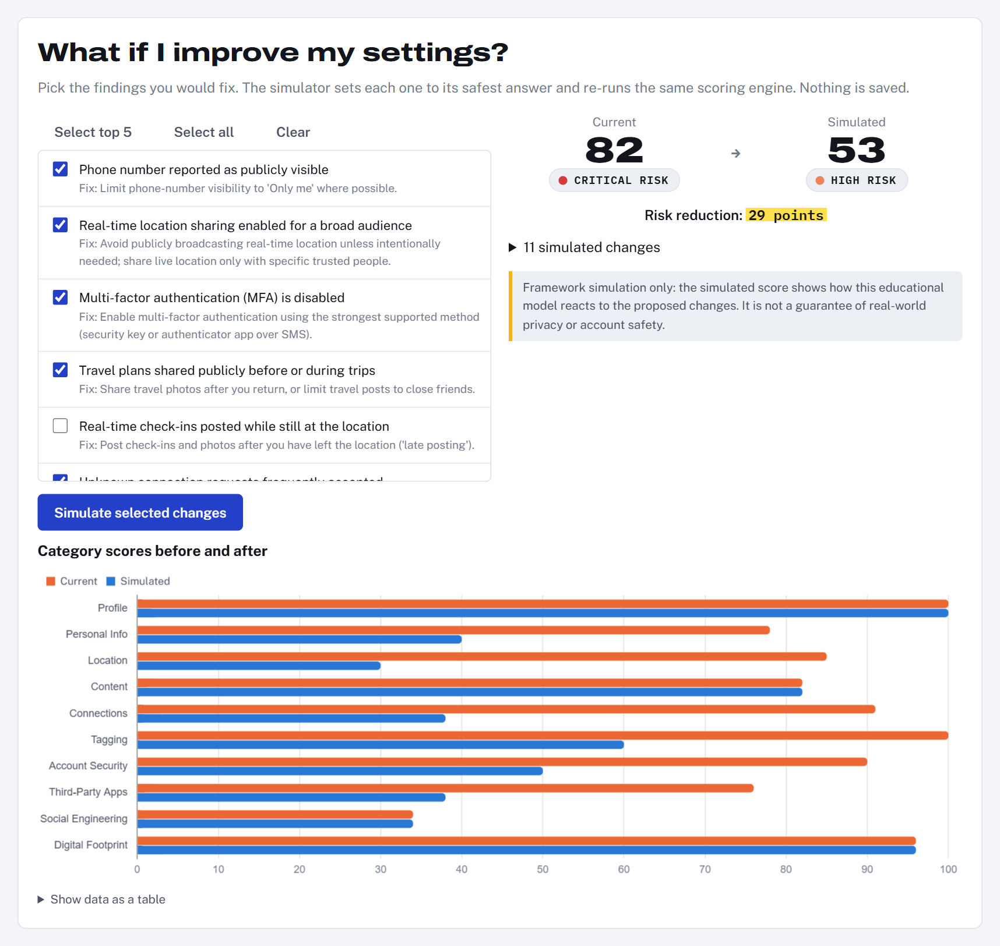

**Dashboard:** you vs 1,000 synthetic records
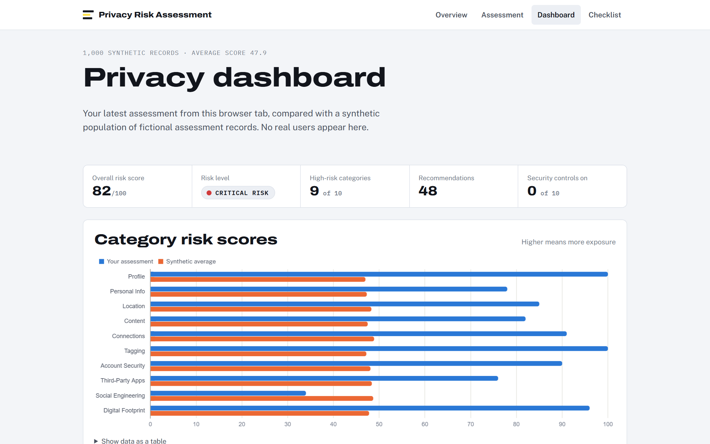

| Questionnaire | Findings & controls | Recommendations |
|---|---|---|
| 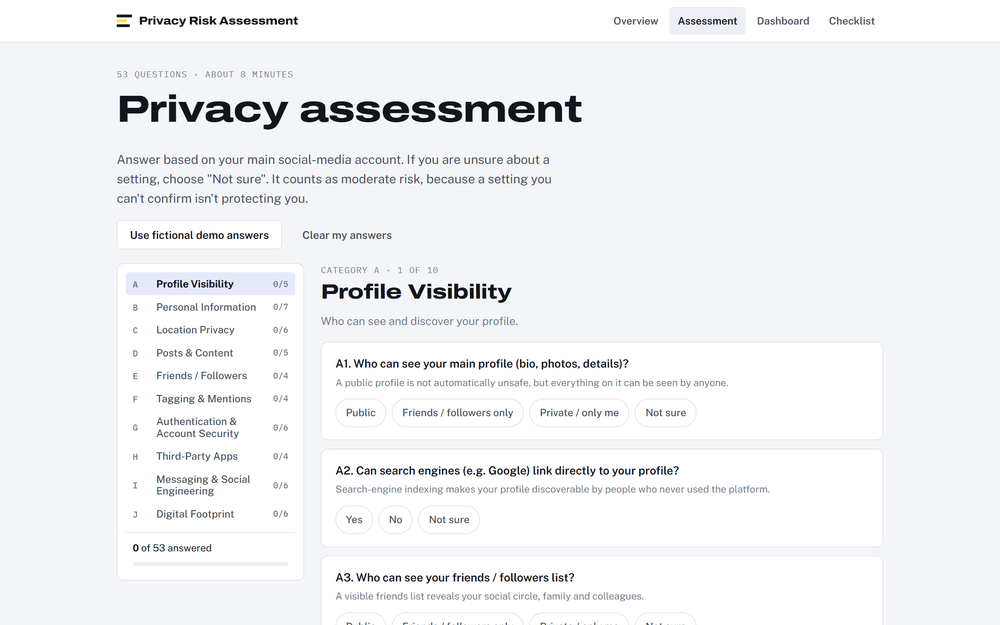 | 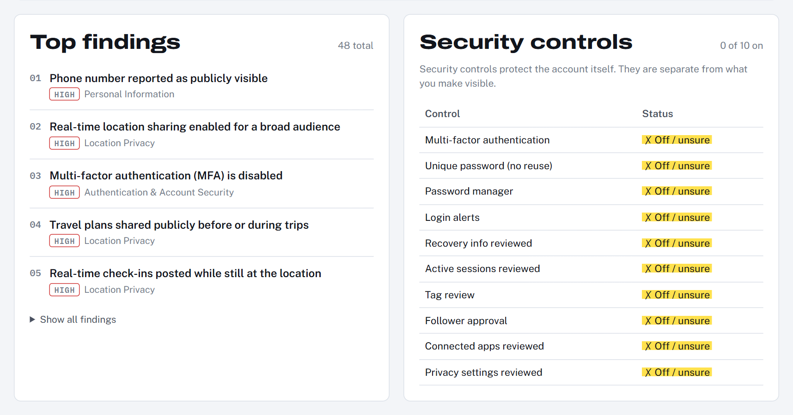 | 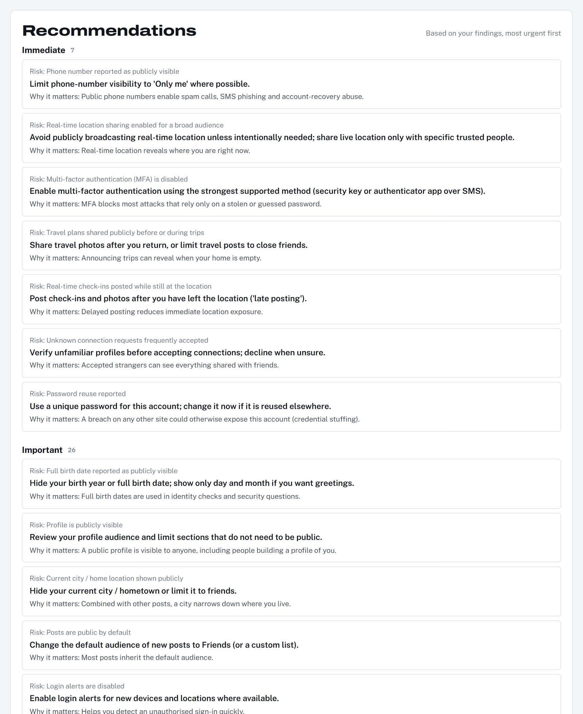 |

| Privacy report | Architecture | 65 tests passing |
|---|---|---|
| 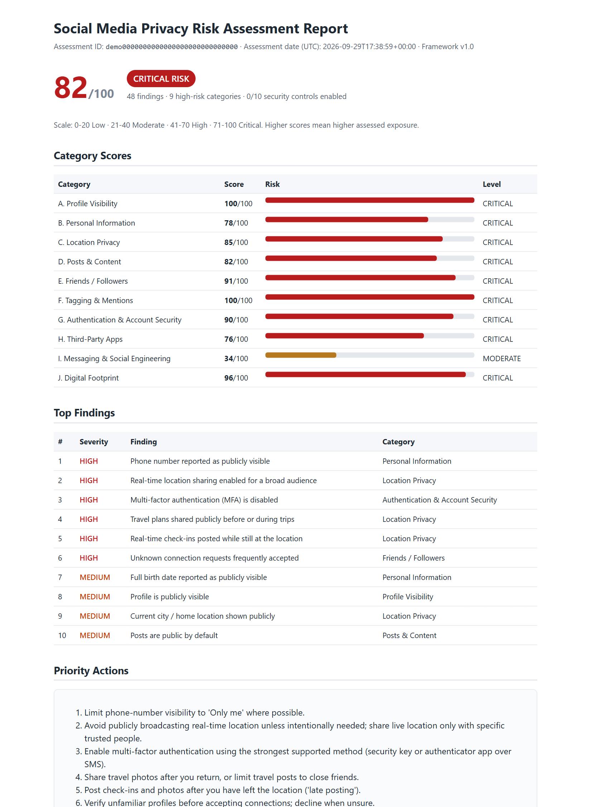 | 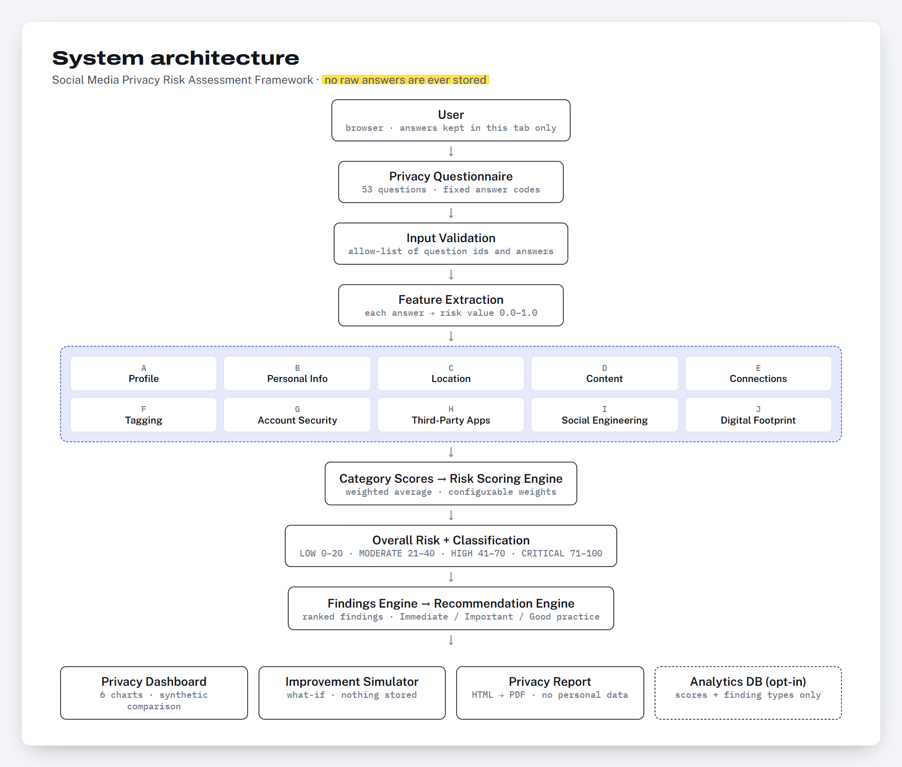 | 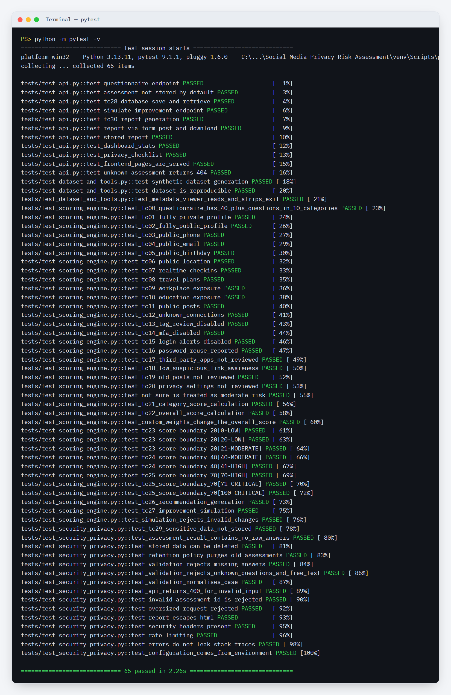 |

## Learning Outcomes
- Translating privacy concepts into a measurable, explainable risk model
- Separating privacy exposure from account-security controls
- Applying privacy by design in schema, API and UI decisions
- Secure web development: validation, output encoding, CSP, rate limiting
- Writing tests that *prove* security and privacy properties
- Generating and analysing synthetic data responsibly

## Project Documentation
| Doc | Contents |
|---|---|
| [01 Project Explanation](docs/01_PROJECT_EXPLANATION.md) | Concepts, workflow, industry relevance, privacy vs security |
| [02 Questionnaire](docs/02_PRIVACY_QUESTIONNAIRE.md) | All 53 questions, scales, weights |
| [03 Risk Model & Analysis](docs/03_RISK_MODEL_AND_ANALYSIS.md) | Dataset, features, scoring, the 10 analyses, findings, recommendations, simulator |
| [04 Architecture, API, DB](docs/04_ARCHITECTURE_API_DATABASE.md) | Architecture, stack, folders, dashboard, report, storage, schema, API |
| [05 Testing](docs/05_TESTING.md) | Test cases TC01–TC30, security and privacy tests |
| [06 Threat Model](docs/06_THREAT_MODEL_AND_RISK_MATRIX.md) | Assets, threats, controls, risk matrix |
| [07 Security Awareness](docs/07_SECURITY_AWARENESS.md) | Social engineering, photo metadata |
| [08 Privacy by Design](docs/08_PRIVACY_BY_DESIGN.md) | Principles mapped to code and tests |
| [09 GitHub & Portfolio](docs/09_GITHUB_AND_PORTFOLIO.md) | Git commands, screenshot list, resume/LinkedIn |
| [10 Project Report](docs/10_PROJECT_REPORT.md) | Full academic report |
| [11 Interview Prep](docs/11_INTERVIEW_PREP.md) | 10 questions and answers |
| [Privacy Checklist](docs/PRIVACY_CHECKLIST.md) | Printable checklist |

## Ethical Disclaimer
This project is designed for defensive cybersecurity and privacy education. It uses synthetic or voluntarily provided assessment responses and does not scrape, track, or profile real social-media users. It never requests phone numbers, addresses, birth dates or passwords, and performs no account enumeration or access to private profiles. The Privacy Risk Score is an educational estimate. It does not guarantee that an account will or will not be compromised.

## Author
**Nischay Prasad** · Cybersecurity course project · GitHub: [@SNischayPrasad](https://github.com/SNischayPrasad)
